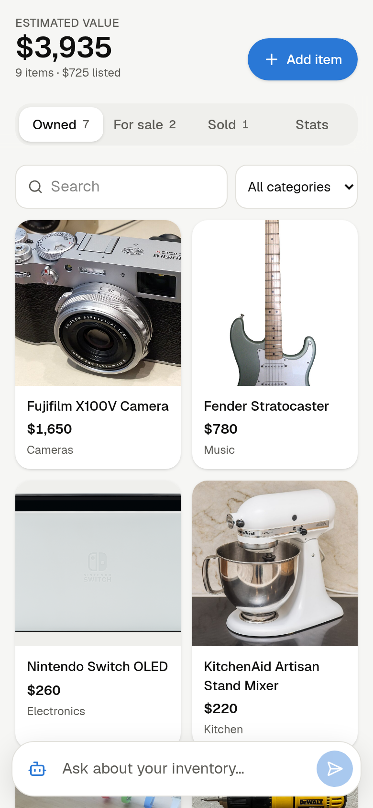
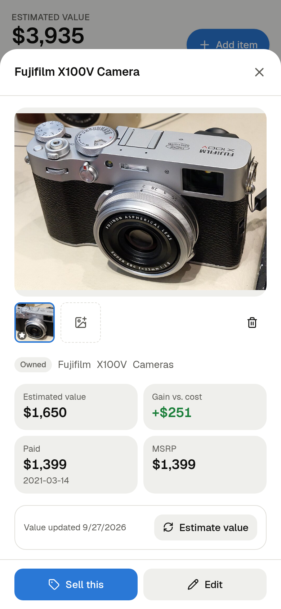
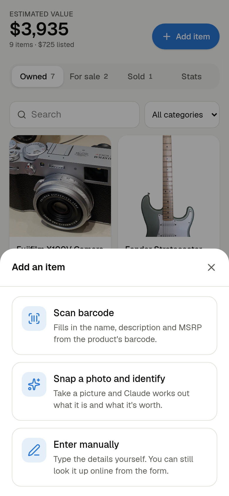
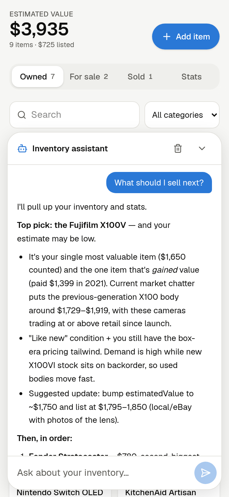
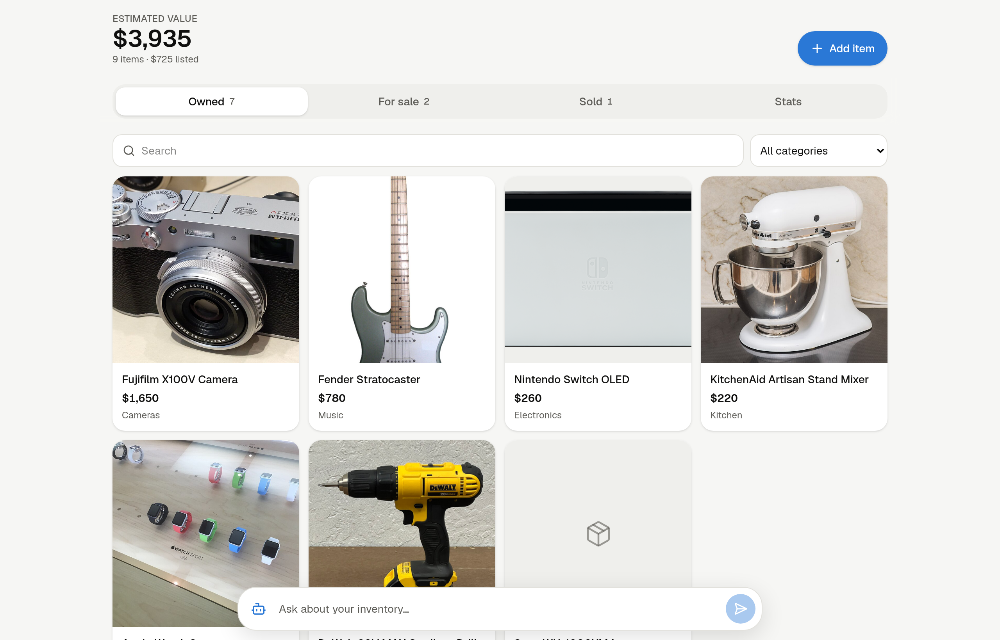
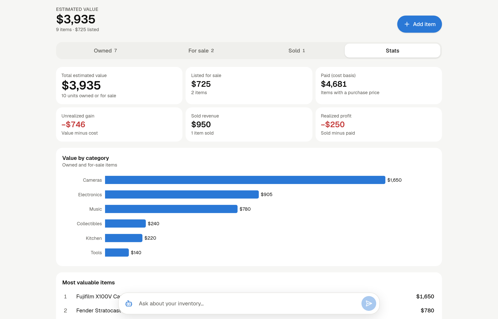
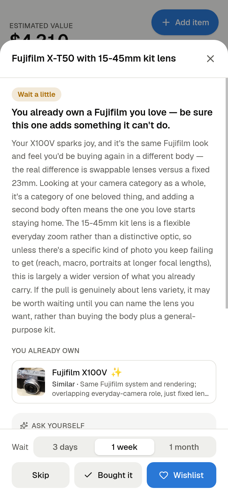
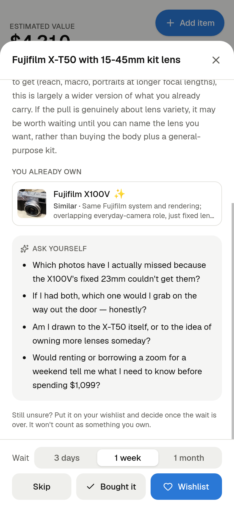

# Inventory Tracker

A self-hosted web app for keeping track of everything you own, what you're selling, what you've sold, and what it's all worth. Add items by scanning a barcode, snapping a photo, or typing them in. An AI assistant, powered by Claude, can answer questions about your stuff.

**Pitch deck:** [the initial design and pitch](https://docs.google.com/presentation/d/1sWD1LqNrcgayIe4fzixb32bBf7VCoue6eGM6s2TjCuQ/edit), presented live at a USC startup incubator event.

<p align="center">
  
  
  
  
</p>



## Features

- **Owned, For sale, Sold and Wishlist tabs**, with search and a category filter. Move an item from Owned to For sale to Sold, recording its asking price and then its sale price, date and platform. Sell some units of an item and keep the rest.
- **Before you buy:** check a possible purchase against everything you own, using ideas from Marie Kondo's KonMari method. See the [example below](#before-you-buy-an-example).
- **Does it spark joy?** Rate what you own as sparking joy, neutral, or not. The ratings feed the "Before you buy" check, and the Stats tab lists items you might let go.
- **Barcode scanning** with the phone camera. Lookups use [UPCitemdb](https://www.upcitemdb.com/) for the name, description, MSRP and images. If a barcode isn't there, the app falls back to a Claude web search.
- **Snap a photo and identify:** Claude recognizes the product, then searches the web for its MSRP, typical used price, and product images.
- **Photos** from the camera, from a file, or from the web. Web images are downloaded and stored locally, and the app only offers image links it has checked will load.
- **Value estimates:** one tap asks Claude to check recent sold listings and estimate what an item would sell for today, with a price range and sources.
- **Stats:**
  - total estimated value, value listed for sale, and cost basis;
  - unrealized gain, and realized profit on sold items;
  - value by category and the most valuable items.
- **Inventory assistant:** a streaming chat panel docked at the bottom. It can search your inventory and the web, for questions like *"what should I sell next?"* or *"I'm thinking of buying a new watch"*. It can also add items with photos, and suggest edits that you confirm with an **Apply** button.
- **Installable on your phone** ("Add to Home Screen"), with a layout designed for phones first and a dark mode.
- **Optional password protection** for when the app is reachable from other devices.



## Before you buy: an example

The goal is for everything you bring home to be something you'll love, not a near-copy of something you already have. Tap **Before you buy**, then type a name, scan a barcode, or snap a photo. Claude compares the item with your inventory and gives you:

- a verdict: **Go for it**, **Wait a little**, or **You're covered**;
- the things you already own that overlap with it;
- anything you own that doesn't spark joy and that it could replace;
- a few questions to ask yourself.

From there, you can put it on your **wishlist** with a cooling-off period of 3 days, 1 week or 1 month. Wishlist items don't count toward your totals, and each one keeps its verdict. When the wait is over, tap **Bought it** or **Let it go**.

In this example, the sample inventory includes a Fujifilm X100V marked ✨ *sparks joy*, and the check is for a **Fujifilm X-T50 with the 15-45mm kit lens, for $1,099**:

<p align="center">
  
  
</p>

> **Wait a little.** You already own a Fujifilm you love. Be sure this one adds something it can't do.
>
> **You already own:** Fujifilm X100V ✨ (*similar*: the same everyday-camera role; the difference is a fixed lens versus interchangeable ones)
>
> **Ask yourself:**
> - Which photos have I actually missed because the X100V's fixed 23mm couldn't get them?
> - If I had both, which one would I grab on the way out the door, honestly?
> - Am I drawn to the X-T50 itself, or to the idea of owning more lenses someday?
> - Would renting or borrowing a zoom for a weekend tell me what I need to know before spending $1,099?

The same check runs in the chat. Tell the assistant *"I'm thinking of buying…"*, and it can add the item to your wishlist for you. The guidance paraphrases Marie Kondo's *The Life-Changing Magic of Tidying Up* (see `lib/ai/konmari.ts`). Verdicts are written by Claude and vary from run to run.

## Tech stack

- [Next.js 16](https://nextjs.org/) (App Router), React 19, TypeScript, Tailwind CSS v4
- SQLite through [Drizzle ORM](https://orm.drizzle.team/) and [libSQL](https://github.com/tursodatabase/libsql). It's a local file by default and can point at [Turso](https://turso.tech/) for cloud hosting.
- [Claude API](https://docs.claude.com/) (`claude-opus-5`) with web search, for identification, value estimates and the chat assistant
- [ZXing](https://github.com/zxing-js/browser) for in-browser barcode scanning, and [Recharts](https://recharts.org/) for charts

## Getting started

You'll need Node.js 20+ and an [Anthropic API key](https://console.anthropic.com/). The key is only needed for the AI features.

```bash
git clone <this repo>
cd inventory-tracker
npm install
cp .env.example .env.local   # add your ANTHROPIC_API_KEY (and optionally APP_PASSWORD)
npm run build
npm start                    # http://localhost:3000
```

For development with hot reload, use `npm run dev`.

The database (`data/inventory.db`) and uploaded photos (`data/uploads/`) are created on first run, and migrations are applied automatically. To back everything up, copy the `data/` folder. Without an API key, everything except the AI features still works.

### Configuration (`.env.local`)

| Variable | Purpose |
|---|---|
| `ANTHROPIC_API_KEY` | Enables photo identification, the barcode fallback, value estimates and chat |
| `DATABASE_URL` | Defaults to `file:./data/inventory.db`. Use `libsql://…` for Turso. |
| `DATABASE_AUTH_TOKEN` | Only needed for a remote libSQL database or Turso |
| `UPLOAD_DIR` | Where photos are stored. Defaults to `./data/uploads`. |
| `APP_PASSWORD` | If set, every page and API route requires signing in |

## Using it on your phone

`npm start` accepts connections from your whole network, not just this computer. On the same Wi-Fi, open `http://<computer-ip>:3000` on your phone. You may need to open port 3000 in your firewall first, for example with `sudo firewall-cmd --add-port=3000/tcp`.

Browsers only allow **live camera video** on HTTPS pages, and the barcode scanner needs it. Photo capture uses the phone's normal camera app, so it works over plain HTTP. Two ways to get HTTPS:

- **[Tailscale](https://tailscale.com/) (recommended):** run `tailscale serve --bg 3000`, then open `https://<machine>.<tailnet>.ts.net` from any of your devices. It has a real certificate, and nothing is exposed to the public internet.
- **Self-signed certificate:** run `npm run dev:https`, then accept the browser's certificate warning on your phone.

Set `APP_PASSWORD` before the app is reachable from anywhere other than this computer.

## Deploying to the cloud

- **Database:** set `DATABASE_URL=libsql://…` and `DATABASE_AUTH_TOKEN` to use Turso. No code changes are needed.
- **Photos:** `lib/storage.ts` writes to local disk. On hosts with persistent volumes (Fly.io, Railway, a VPS), point `UPLOAD_DIR` at the volume. On serverless hosts, replace that module with S3 or R2 calls.

## How values are calculated

Each item counts at its **estimated value**, falling back to its **MSRP** and then its **purchase price**, multiplied by quantity. Gains and profits only include items that have a purchase price.

## Project layout

| Path | Contents |
|---|---|
| `app/api/` | Route handlers: items, images, selling, barcode lookup, identify, reprice, buy check, stats, chat, login |
| `components/` | UI: inventory grid, add-item flow, barcode scanner, item details, stats, chat dock |
| `db/schema.ts`, `db/migrations/` | Database schema. After changing the schema, run `npm run db:generate`. |
| `lib/items.ts` | Item queries and the stats calculations |
| `lib/barcode.ts` | UPCitemdb lookup |
| `lib/ai/identify.ts` | Product identification and value estimates (Claude with web search) |
| `lib/ai/assistant.ts` | The chat assistant: inventory tools, photos, edit proposals, purchase checks and web search |
| `lib/ai/buy-check.ts`, `lib/ai/konmari.ts` | The "Before you buy" check and the KonMari guidance it uses |
| `lib/images.ts` | Checks that suggested image URLs actually load |
| `proxy.ts` | The optional password gate |

## Screenshot credits

The screenshots use sample data. The product photos come from Wikimedia Commons:

| Item | Photo | License |
|---|---|---|
| Fujifilm X100V | [昼落ち](https://commons.wikimedia.org/wiki/File:Fujifilm_X100V_9_feb_2020b.jpg) | CC BY-SA 4.0 |
| Fender Stratocaster | [Stra2caster, derivative by Atlantictire](https://commons.wikimedia.org/wiki/File:Fender_Stratocaster_004-2.jpg) | Public domain |
| Nintendo Switch OLED | [PantheraLeo1359531](https://commons.wikimedia.org/wiki/File:Nintendo_Switch_%E2%80%93_OLED-Modell_mit_gedockter_Konsole_20230506_HOF01624_RAW-Export.png) | CC BY 4.0 |
| KitchenAid stand mixer | [Your Best Digs](https://commons.wikimedia.org/wiki/File:White_KitchenAid_mixer_(KSM150PSWH).jpg) | CC BY 2.0 |
| Apple Watch Sport | [thomersch](https://commons.wikimedia.org/wiki/File:Apple_Watch_Sport.jpg) | CC BY 4.0 |
| DeWalt drill | [TaurusEmerald](https://commons.wikimedia.org/wiki/File:DeWalt_20_Volt_Max_Cordless_Drill.jpg) | CC BY-SA 4.0 |
| iPad Air | [メイド理世](https://commons.wikimedia.org/wiki/File:About_iPad_Air_11-inch_(M2).jpg) | CC BY-SA 4.0 |
| LEGO Millennium Falcon | [Cappo80](https://commons.wikimedia.org/wiki/File:Millennium_falcon_lego.jpg) | Public domain |
| Road bike | [Roy Egloff](https://commons.wikimedia.org/wiki/File:CH.ZH.Affoltern-am-Albis_2024-03-30_road-bike-racing.jpg) | CC BY-SA 4.0 |

Product names and trademarks belong to their owners.
